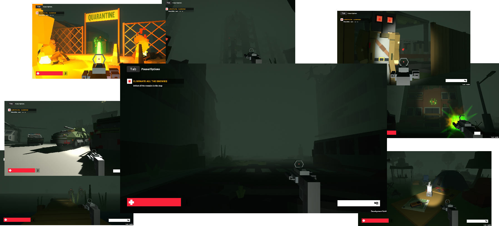

# Spooky

> Spooky experience with spooky fps mechanics

**Controls**

- **Movement**: WASD or ZQSD
- **Shoot**: Left Mouse
- **Aim**: Right Mouse
- **Jump**: Space
- **Crouch**: C
- **Sprint**: Shift
- **Pause**: Tab or P

## How to try the game

- Clone or download the Build folder
- Launch `Spooky.exe`

## About the game

I found I like working with lights and I wanted to make a game with some that are useful to the gameplay. So I figured why not some dark scary thing in first person with a flashlight?

This game is made in Unity, from the [FPS Microgame](https://learn.unity.com/project/fps-template "Unity details page").

Pretty much all assets used are from the [Simple Apocalypse pack](https://syntystore.com/collections/simple-series/products/simple-apocalypse-cartoon-assets "Stynty Store product page") from [Synty Studios](https://www.syntystudios.com/ "Synty Studios homepage"), bought on [Humble Bundle](https://www.humblebundle.com/ "Humble Bundle homepage").

A lot of this game was already in the [FPS Microgame](https://learn.unity.com/project/fps-template "Unity details page") and the level and models by [Synty Studios](https://www.syntystudios.com/ "Synty Studios homepage"). But it's the first time I really tried to create an ambiance for the potential player. So I changed some scripts and mostly tuned behaviors, the lights and the fog to get to what I wanted.
